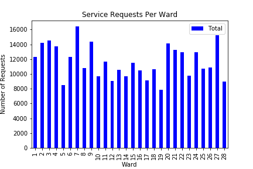
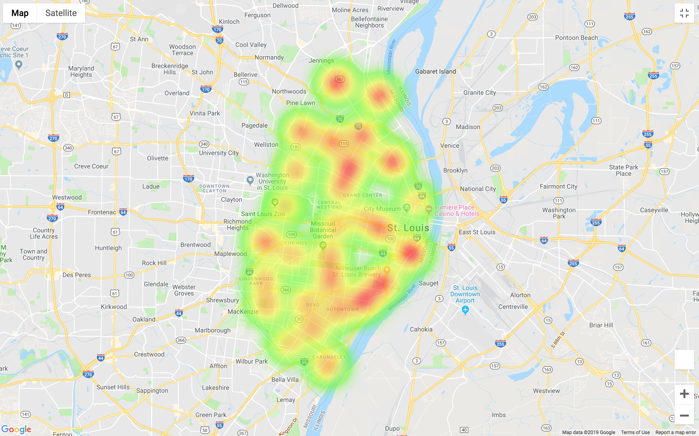
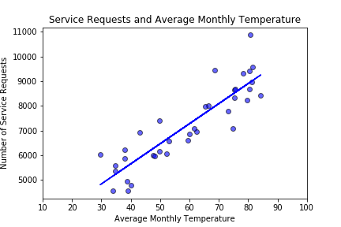
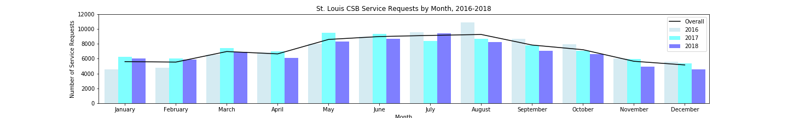
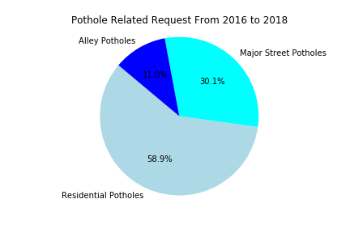

# STL Service Calls

For this project, my teammates and I used Python to analyze and report on three years worth of Saint Louis service requests data (2016, 2017, and 2018). We used Python tools such as pandas, matplotlib, and jupyter-notebook to extract and graph our findings. The data was gathered from the Citizens' Service Bureau (CSB) @ https://www.stlouis-mo.gov/data/datasets/distribution.cfm?id=2

*WASHSTL Data Analytics Bootcamp Group Project*
### Team Members:
- Brian Kramer
- Renee O'Reilly
- Theodore Moreland

### Citizens' Service Bureau

The Citizens' Service Bureau's (CSB) purpose is to effectively and efficiently register and route city service requests, answer citizen requests for information, and provide City departments with statistics as needed.

https://www.stlouis-mo.gov/government/departments/public-safety/neighborhood-stabilization-office/citizens-service-bureau/

## Research Questions:
* Are there different rates in overall service requests across the 28 wards of St. Louis?
* Are there Certain Areas of the City that have Submitted more Service Requests?
* Is there a Correlation between Service Requests and Average Monthly Temperature?
* Are there different rates in overall service requests by month and year?
* Is there a difference in the type of Pothole Service Request by Year and Overall?

# Visualizations

## Service Requests Per Ward (Bar Chart)

## Service Requests Per Ward (Heat Map)

## Service Requests and Average Monthly Temparature (Scatter Plot)

## Service Requests By Month and Year (Bar Chart + Line Graph)

## Pothole Requests By Type (Pie Chart)

# Conclusions

### St. Louis wards had different number of service requests
* Ward #7 had approximately 16,000 service requests, while Ward #19 only had about 7,800. Not much can be inferred from those findings alone, but the disparity does give us a basis for further analysis.
* Highest number of requests occurred in the downtown area which may be indicative of people traveling to the area for work and entertainment and reporting issues
* Service request concerning potholes are most common for residential areas and least common when regarding alleys. Request made for potholes in residential areas are almost twice as likely as request made for major streets; this statistic remains true across all three years of data with the total number of residential related request being 7382 and the total number of request made concerning major streets is 3773.

### There is a positive relationship between number of service requests and average monthly temperature
* The summer months have a higher number of service requests

